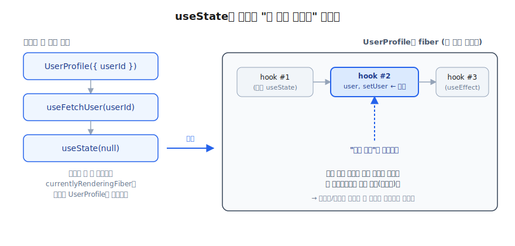
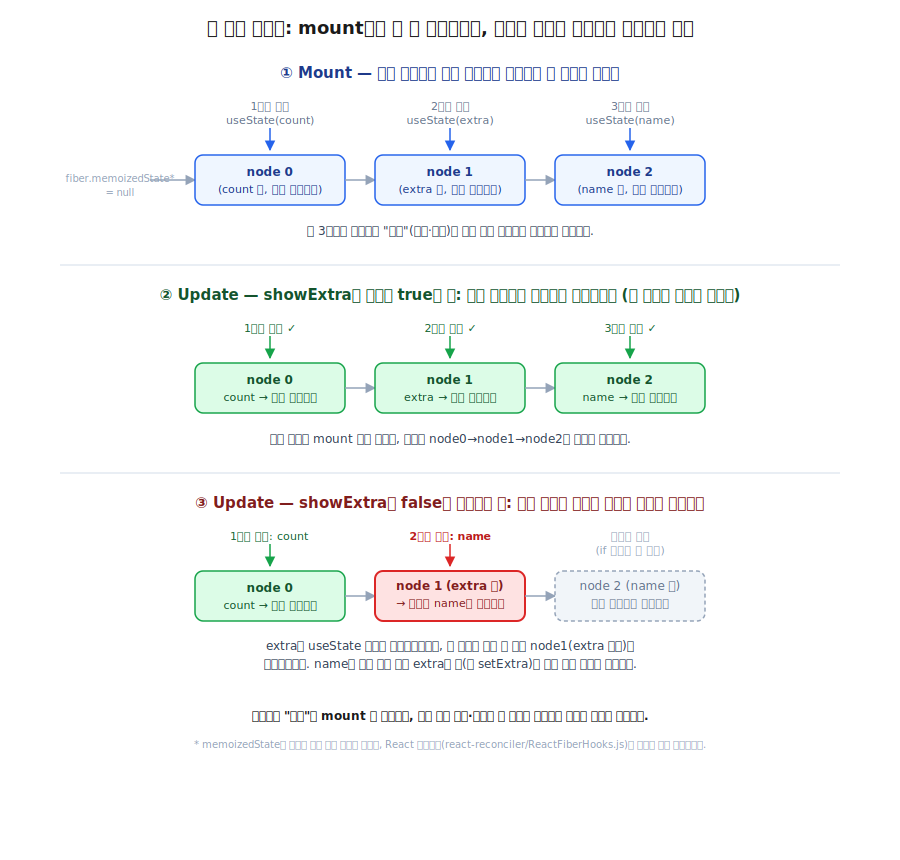
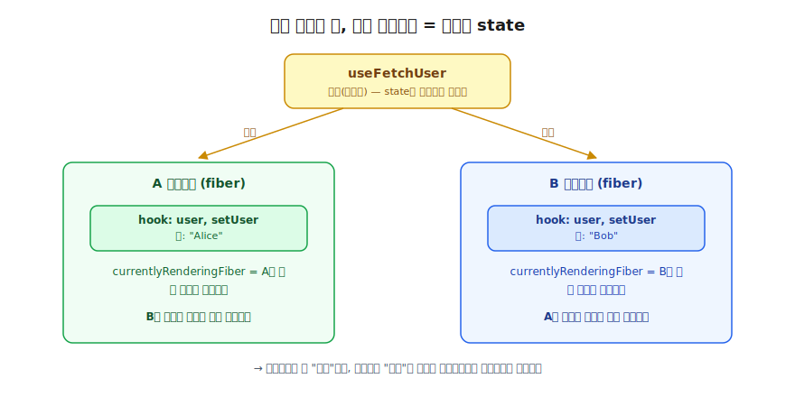

# 오늘 학습한 내용

## [React] 커스텀 훅은 사기꾼이다 — state는 다른 놈이 갖고 있었다

React 커스텀 훅을 공부하다가 "React가 내부적으로 지금 렌더링 중인 컴포넌트를 기록해뒀다가, 그걸 기준으로 useState 슬롯을 배정한다"는 문구를 보고, 이게 사실이라면 커스텀 훅과 state의 관계가 어떻게 되는 건지 하나씩 따라가며 이해한 내용을 정리한다.

### useState는 "몇 번째 훅인지"를 어떻게 아는가

React는 렌더링을 시작할 때 "지금 렌더링 중인 컴포넌트(fiber)"를 가리키는 내부 포인터를 하나 들고 있다. 그리고 각 컴포넌트(fiber)는 자신만의 훅 연결 리스트를 가지고 있어서, `useState`나 `useEffect` 같은 훅이 호출될 때마다 이 리스트에 노드가 하나씩 쌓인다.

렌더링이 진행되는 동안 React는 이 리스트를 순회하는 커서를 하나 들고 있다가, 훅이 호출될 때마다 "다음 노드"를 그 훅에 배정한다. 즉 슬롯을 결정하는 기준은 **훅의 이름이나 변수명이 아니라 그 렌더링 안에서의 호출 순서(인덱스)** 다. 첫 렌더링(mount)에서는 새 노드를 만들고, 재렌더링(update)에서는 기존 리스트를 순서대로 따라가며 같은 위치의 노드를 재사용해서 이전 state 값을 돌려준다.

이 원리를 알고 나니 "훅을 조건문이나 반복문 안에서 호출하면 안 된다"는 규칙(Rules of Hooks)이 왜 있는지도 같이 이해됐다. 렌더링마다 호출 순서가 달라지면 순서 기반으로 슬롯을 매칭하는 방식이 깨지기 때문에, 이전 렌더링의 state가 엉뚱한 훅에 배정돼버릴 수 있다.



### 훅 연결 리스트는 "최초 렌더링" 때 딱 한 번 만들어진다

여기서 헷갈렸던 부분이 있었다. 재렌더링될 때마다 훅 연결 리스트에 노드가 계속 쌓이는 줄 알았는데, 그게 아니었다. **훅 연결 리스트는 최초 렌더링(mount) 시점에 딱 한 번 만들어지고, 그 이후의 모든 재렌더링(update)은 이미 만들어진 그 리스트를 처음부터 다시 순회할 뿐**이다.

- mount: 아직 리스트가 비어있는 상태(`fiber.memoizedState = null`)에서 `useState`가 호출될 때마다 새 노드를 만들어 이어붙인다. 이때 만들어진 리스트의 개수와 순서가 이 컴포넌트 인스턴스의 훅 연결 리스트로 고정된다. (`memoizedState`는 설명을 위해 붙인 이름이 아니라, React 소스코드[react-reconciler/ReactFiberHooks.js]에 실제로 있는 필드명이다.)
- update: 새 노드를 만들지 않는다. mount 때 만든 리스트의 첫 번째 노드부터 커서를 놓고, `useState`가 호출될 때마다 "다음 노드로 이동"하면서 그 노드에 저장된 값을 돌려줄 뿐이다.

즉 React가 기억하는 건 정확히 **최초 렌더링 시점에 확정된 슬롯 순서**이고, 이후 모든 렌더링은 그 순서에 맞춰 정확히 같은 횟수·같은 순서로 훅을 호출해야만 커서가 올바른 노드에 도달한다.

이 관점에서 조건문 예시를 보면 왜 문제가 되는지 더 명확해진다.

```jsx
function Counter({ showExtra }) {
  const [count, setCount] = useState(0);   // 훅 1번째

  if (showExtra) {
    const [extra, setExtra] = useState(0); // 조건부로만 호출된다
  }

  const [name, setName] = useState('');    // showExtra에 따라 순서가 밀린다
}
```

`showExtra = true`로 mount됐다면 훅 연결 리스트는 `[count] → [extra] → [name]`으로 고정된다. 그런데 다음 렌더링에서 `showExtra = false`가 되면 `extra`의 `useState` 호출 자체가 건너뛰어지므로, 실제 호출 순서는 `count → name`이 된다. 커서는 몇 번째로 불렸는지만 보고 기계적으로 다음 노드를 넘겨주기 때문에, 두 번째 호출인 `name`이 mount 때 만들어진 리스트의 두 번째 노드, 즉 원래 `extra`를 위해 만들어졌던 노드를 그대로 받아버린다. `name`이 자기 상태가 아니라 `extra`의 값(과 `setExtra`)을 잘못 받는 사고가 나는 것이다.



### 커스텀 훅은 state를 담는 그릇이 아니다

실제로 코드로 옮겨보면 이런 모양이다. `useFetchUser`가 `user`/`setUser` state와 데이터를 가져오는 로직을 감싸고, `UserProfile`은 그 결과만 받아서 렌더링만 한다.

```jsx
function useFetchUser(userId) {
  const [user, setUser] = useState(null);

  useEffect(() => {
    fetch(`/api/users/${userId}`)
      .then((res) => res.json())
      .then((data) => setUser(data));
  }, [userId]);

  return user;
}

function UserProfile({ userId }) {
  const user = useFetchUser(userId);

  if (!user) return <p>로딩 중...</p>;

  return <h1>{user.name}</h1>;
}
```

여기서 든 질문은 이거였다. `UserProfile`이라는 컴포넌트가 `useFetchUser`라는 커스텀 훅을 쓰고, 실제 `user`/`setUser` state는 `useFetchUser` 안에 있다면, 그 state는 `useFetchUser`에 귀속되는 걸까?

답은 아니다. `useFetchUser`는 React 입장에서 아무 정체성이 없는 평범한 JS 함수일 뿐이다. React가 아는 건 "지금 `UserProfile`을 렌더링 중이다"라는 사실뿐이라, 함수 호출이 몇 겹으로 중첩되든 `useState`가 실제로 실행되는 시점에 `currentlyRenderingFiber`는 여전히 `UserProfile`을 가리키고 있다.

```text
UserProfile 렌더링 시작 (currentlyRenderingFiber = UserProfile)
  → useFetchUser() 호출
    → 내부에서 useState(null) 호출
      → React: "지금 렌더링 중인 fiber가 UserProfile이니까,
                 UserProfile의 훅 연결 리스트 다음 슬롯에 이 state를 연결하자"
```

그래서 아래 두 코드는 React 런타임 관점에서 사실상 동치다.

```jsx
function UserProfile() {
  const [user, setUser] = useFetchUser(); // 이거나
  const [user, setUser] = useState(null); // 이거나
  // React 입장에서 슬롯 배정 방식은 동일함
}
```

커스텀 훅은 **로직 재사용을 위한 문법적 편의**일 뿐, state가 실제로 귀속되는 곳은 언제나 호출 스택의 끝에서 렌더링되고 있는 컴포넌트다.

### 같은 컴포넌트에서 같은 커스텀 훅을 두 번 호출하면?

이 원리를 따라가면, 한 컴포넌트에서 같은 커스텀 훅을 두 번 호출해도(`useFetchUser('a')`, `useFetchUser('b')`) 완전히 독립된 state 두 쌍이 생긴다는 것도 자연스럽게 설명된다. `useFetchUser`라는 "훅 인스턴스" 단위로 state가 분리 저장되는 게 아니라, 둘 다 같은 컴포넌트의 훅 연결 리스트에서 서로 다른 슬롯(위치)을 차지할 뿐이기 때문이다.

### 다른 컴포넌트에서 같은 커스텀 훅을 호출하면?

같은 이유로, `useFetchUser`를 A 컴포넌트와 B 컴포넌트에서 각각 호출하면 두 컴포넌트가 각자 독립된 `user`/`setUser` 상태를 가지게 된다.

```jsx
function A() {
  const [user, setUser] = useFetchUser(); // A의 fiber 훅 연결 리스트에 연결
}

function B() {
  const [user, setUser] = useFetchUser(); // B의 fiber 훅 연결 리스트에 연결 (완전 별개)
}
```

- `A` 렌더링 시작 → `currentlyRenderingFiber = A` → `useFetchUser` 내부의 `useState`가 A의 훅 연결 리스트에 슬롯을 만든다.
- `B` 렌더링 시작 → `currentlyRenderingFiber = B` → 같은 `useFetchUser` 함수를 호출해도 이번엔 B의 훅 연결 리스트에 별도 슬롯이 생긴다.

`useFetchUser`는 "state를 만들고 관리하는 로직이 적힌 설계도(템플릿)"이고, 실제 state라는 "실체"는 그 설계도를 호출한 컴포넌트의 fiber에 매번 새로 지어진다. 그래서 A가 `user`를 업데이트해도 B의 `user`에는 전혀 영향이 없다.



### 정리

- 훅 연결 리스트는 최초 렌더링(mount) 때 딱 한 번 만들어지고, 재렌더링(update)에서는 새 노드를 만들지 않고 그 리스트를 처음부터 다시 순회하며 재사용한다.
- `useState`의 슬롯 배정 기준은 훅 이름이 아니라, 지금 렌더링 중인 컴포넌트(fiber)의 훅 연결 리스트에서의 호출 순서다. 이게 곧 Rules of Hooks(조건문/반복문 안에서 훅 호출 금지)의 근거가 된다.
- 커스텀 훅은 state를 소유하지 않는다. 커스텀 훅 안에서 호출한 `useState`도 결국 그 커스텀 훅을 호출한 컴포넌트의 fiber에 슬롯이 배정된다.
- 결과적으로 커스텀 훅은 "로직은 공유하되 상태는 격리된다." 같은 커스텀 훅을 여러 컴포넌트에서 호출하면 각 컴포넌트가 완전히 독립된 상태를 갖고, 같은 컴포넌트 안에서 여러 번 호출해도 각 호출이 별도의 슬롯을 차지해 서로 간섭하지 않는다.
