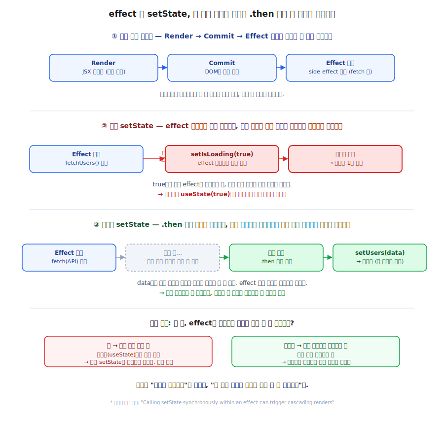

# 오늘 학습한 내용

## [React] setState, 값으로 줄까 함수로 줄까 — "함수형 업데이트"가 진짜 뜻하는 것

React의 useState 훅을 배울 때 빠지지 않고 등장하는 예시가 바로 Counter이다.

상태를 업데이트하는 방법이 `setCount((prevCount) => prevCount + 1)`와 `setCount(count + 1)` 두 가지가 있다는 건 알고 있었으나, 둘이 정확히 어떻게 다른지 이번 기회에 자세히 알아보기로 했다.

### 값으로 넘기기 vs 함수로 넘기기: 뭐가 다른가

한 이벤트 핸들러 안에서 같은 상태를 여러 번 갱신하는 경우를 보면 차이가 바로 드러난다.

```jsx
// count + 1 방식 — 3번 불러도 1만 증가
onClick={() => {
  setCount(count + 1)
  setCount(count + 1)
  setCount(count + 1)
}}

// prevCount => prevCount + 1 방식 — 3번 불러오면 3 증가
onClick={() => {
  setCount(prev => prev + 1)
  setCount(prev => prev + 1)
  setCount(prev => prev + 1)
}}
```

`count + 1` 세 줄은 전부 같은 클로저의 `count`(예: 0)를 참조하므로, 사실상 `setCount(1)`을 세 번 호출하는 것과 같다. React가 여러 `setState` 호출을 배치(batch) 처리하기 때문에 마지막 호출만 반영되는 셈이다. 반면 함수형 업데이트는 큐에 쌓인 순서대로 "직전 결과"를 넘겨받아 계산하므로 호출한 만큼 누적된다.

비동기 콜백 안에서도 같은 문제가 생긴다.

```jsx
setTimeout(() => setCount(count + 1), 3000); // 3초 전 렌더의 count를 캡처 (stale closure)
setTimeout(() => setCount((prev) => prev + 1), 3000); // 실행 시점의 최신 값 기준으로 계산
```

결론적으로 두 방식의 차이는, `setCount`에 넘기는 **"다음 상태값"을 미리 계산해서 값으로 주느냐, 계산 방법(함수)으로 줘서 React가 실행 시점에 대신 계산하게 하느냐**의 차이다. 최종적으로 상태에 들어가는 건 언제나 값 하나지만, 그 값을 만드는 시점이 "지금(렌더링 시점)"이냐 "나중(업데이트 적용 시점)"이냐가 갈린다.

### "함수형 업데이트"라는 이름이 헷갈렸던 이유

처음엔 "함수형 업데이트"라는 이름 때문에, `setCount` 호출 자체가 함수형이라서 붙은 이름인가 헷갈렸다. 하지만 두 방식 모두 `setCount`라는 **함수를 호출**하는 건 동일하다. 이름이 가리키는 건 호출 행위가 아니라 **`setCount`에 넘기는 인자의 타입**이다.

```jsx
setCount(count + 1); // 인자: 값(value)
setCount((prev) => prev + 1); // 인자: 함수(function)
```

즉 "함수형 업데이트"는 정확히는 "업데이트 로직을 함수로 넘기는 방식"이라는 뜻이다.

### 실제 React 소스코드로 확인 — useState는 4개 부품이 협력해서 동작한다

의사코드로 짐작만 하지 말고 Claude의 도움을 받아서 실제 소스(`packages/react-reconciler/src/ReactFiberHooks.js`, main 브랜치)를 확인했다. `useState`는 하나의 함수가 아니라 4개 부품이 각자 다른 시점에 실행되며 협력한다.

#### mountStateImpl — 최초 렌더링 시 1번 실행, 저장 공간 생성

```js
function mountStateImpl<S>(initialState: (() => S) | S): Hook {
  const hook = mountWorkInProgressHook();

  // 초기값 자체가 함수로 넘어온 경우 (지연 초기화)
  if (typeof initialState === 'function') {
    const initialStateInitializer = initialState;
    initialState = initialStateInitializer(); // mount 시점에 딱 1번 실행
  }

  hook.memoizedState = hook.baseState = initialState;

  const queue: UpdateQueue<S, BasicStateAction<S>> = {
    pending: null,
    lanes: NoLanes,
    dispatch: null,
    lastRenderedReducer: basicStateReducer, // 이후 계산 규칙을 여기 고정
    lastRenderedState: initialState,
  };
  hook.queue = queue;
  return hook;
}
```

여기엔 서로 다른 두 가지 일이 섞여 있다.

- `useState(0)`처럼 값을 넘기면 그대로 쓰고, `useState(() => 계산)`처럼 함수를 넘기면 그 함수를 실행해서 나온 값을 초기값으로 쓴다. **mount 때 딱 1번**만 일어나는 일이다. (이건 값/함수형 업데이트와는 별개의, `useState`의 지연 초기화 기능이다.)
- 계산된 초기값을 저장하고, 앞으로 이 상태를 업데이트할 때 쓸 규칙(`basicStateReducer`)을 큐에 고정해둔다. 값/함수형 업데이트 이야기는 여기서 고정해둔 `basicStateReducer`가 담당하는 부분이다.

#### dispatchSetState — setCount(x) 호출마다 실행, 큐에 항목 추가

```js
function dispatchSetStateInternal<S, A>(
  fiber: Fiber, queue: UpdateQueue<S, A>, action: A, lane: Lane,
): boolean {
  const update: Update<S, A> = {
    lane,
    action, // setCount에 넘긴 값/함수가 그대로 여기 담김
    hasEagerState: false,
    eagerState: null,
    next: null,
  };

  const root = enqueueConcurrentHookUpdate(fiber, queue, update, lane); // 큐에 연결
  if (root !== null) {
    scheduleUpdateOnFiber(root, fiber, lane); // 리렌더링 예약
    return true;
  }
  return false;
}
```

`setCount`에 넘긴 인자를 그대로 `update.action`에 담아 큐에 이어 붙이고, React에 리렌더링을 요청한다. 이 시점엔 아직 계산하지 않는다.

#### updateReducerImpl — 리렌더링 시 실행, 큐를 순회하며 계산

```js
function updateReducerImpl<S, A>(hook: Hook, current: Hook, reducer: (S, A) => S): [S, Dispatch<A>] {
  const queue = hook.queue;
  queue.lastRenderedReducer = reducer;

  const first = baseQueue.next;
  let newState = baseState;
  let update = first;

  do {
    newState = reducer(newState, update.action); // basicStateReducer 호출 지점
    update = update.next;
  } while (update !== null && update !== first);

  hook.memoizedState = newState;
  return [newState, dispatch];
}
```

큐에 쌓인 업데이트들을 순서대로 꺼내며 `newState = reducer(newState, update.action)`을 반복 호출한다. 여기 `reducer` 자리에 들어가는 게 mount 때 고정해둔 `basicStateReducer`다.

#### basicStateReducer — 항목 하나를 실제로 계산

```js
function basicStateReducer<S>(state: S, action: BasicStateAction<S>): S {
  return typeof action === 'function' ? action(state) : action;
}
```

`action`(=setCount에 넘긴 인자)이 함수면 `action(state)`를 호출해 그 결과를 새 상태로 쓰고, 함수가 아니면 그대로 새 상태로 쓴다. 짐작했던 조건 분기가 실제로 이 한 줄로 구현돼 있었다.

#### 4개 부품을 이어 보면 (클릭 3번, `setCount(prev => prev + 1)`)

1. **Mount**: `mountStateImpl(0)` 실행 → `count = 0` 저장, 큐 생성하며 `lastRenderedReducer = basicStateReducer` 고정.
2. **클릭 3번**: `dispatchSetState` 3번 실행 → 큐에 `[fn1, fn2, fn3]` 연결 → 리렌더링 예약.
3. **리렌더링**: `updateReducerImpl` 실행 → 큐 순회하며 `basicStateReducer(0, fn1) → 1`, `basicStateReducer(1, fn2) → 2`, `basicStateReducer(2, fn3) → 3`.
4. **결과**: `count = 3`.

`useState`가 완전히 독립된 훅이 아니라 내부적으로 `useReducer`를 재사용한다는 것도 이 구조에서 자연스럽게 확인된다. `const [count, setCount] = useState(0)`는 개념적으로 `useReducer(basicStateReducer, 0)`와 거의 동일하다 — 개발자가 직접 만든 reducer 대신 React가 미리 만들어둔 `basicStateReducer`가 고정된다는 점만 다르다.

### reducer, dispatch, action — 용어 정리

React 코드를 읽다 보면 계속 마주치는 세 단어를, 방금 확인한 소스코드의 매개변수 이름과 직접 연결해서 정리했다.

#### reducer — Array.prototype.reduce와 정확히 같은 모양

```js
[1, 2, 3, 4].reduce((acc, cur) => acc + cur, 0);
//                    ↑        ↑
//               누적된 값   새로 들어온 값
```

`reduce`는 배열의 여러 항목을 순서대로 훑으며 "지금까지 누적된 값 + 새 항목"을 계산해 하나의 최종값으로 압축한다. React의 reducer도 시그니처가 똑같다 — `reducer(state, action)`. 실제로 `updateReducerImpl`의 핵심 줄(`newState = reducer(newState, update.action)`)이 큐에 쌓인 액션들을 순서대로 훑으며 하나의 최종 상태값으로 압축하는 동작이라, `Array.reduce`와 이름의 유래가 같다.

#### dispatch — 계산 없이 전달만 하는 함수

`dispatch`는 "보내다, 전달하다"라는 뜻 그대로다. `dispatch(action)`을 호출해도 새 상태를 계산하지 않는다. "이런 액션이 발생했다"는 사실을 큐에 기록해서 넘기기만 한다. 실제 계산은 나중에 렌더링 시점에 `updateReducerImpl`이 큐를 순회하며 처리한다. `setCount`도 사실 `dispatch`의 한 종류였던 셈이다.

#### action — dispatch가 reducer에게 넘기는 "무슨 일이 일어났는지"

`action`은 `dispatchSetState(fiber, queue, action)`과 `basicStateReducer(state, action)`에 등장하는 그 매개변수 이름이다. `useState`에서는 `action`이 단순히 값이거나 업데이트 함수였다. `useReducer`나 Redux에서는 관례적으로 `{ type, payload }` 형태 객체로 만들어, 어떤 종류의 변화가 일어났고 그 변화에 필요한 데이터는 뭔지를 담는다.

```js
dispatch({ type: "increment" });
dispatch({ type: "setName", payload: "hugo" });
```

둘 다 "reducer에게 무슨 일이 일어났는지 알려주는 값"이라는 역할은 동일하다.

### 왜 값과 함수, 두 가지 형태를 다 지원할까

"그럼 아예 함수형 업데이트만 강제하면 오류를 원천 차단할 수 있는 거 아닌가?"라는 질문이 들었는데, 결론은 **강제하지 않는 게 더 나은 설계**라고 판단했다. 이유는 두 가지다.

#### 값 형태가 필요한 이유: 이전 상태와 무관한 갱신이 훨씬 흔하다

```jsx
setName(e.target.value); // 인풋에서 온 새 값 — 이전 값에 뭘 더하는 게 아님
setIsOpen(true); // 그냥 고정값
setUser(fetchedUser); // API 응답 그대로 대입
```

이걸 억지로 함수형으로 쓰면 `setName(prev => e.target.value)`처럼 `prev` 파라미터를 아예 안 쓰는 코드가 된다. 이건 "이 상태가 이전 값에 의존해서 계산된다"는 거짓 신호를 줘서 오히려 가독성을 해친다. 값으로 바로 넘기는 쪽이 "이전 상태와 무관하게 이 값으로 바뀐다"는 의도를 정확히 드러낸다.

#### 함수형 강제가 실제로 막아주는 오류 범위는 좁다

함수형 업데이트가 꼭 필요한 상황은 딱 두 가지로 좁혀진다.

1. 한 이벤트/함수 안에서 같은 상태를 여러 번 갱신할 때(위의 3번 클릭 예시)
2. `setTimeout`, `useEffect`, 오래된 클로저 안에서 갱신할 때(stale closure)

이 두 상황이 아니면 값으로 넘기든 함수로 넘기든 결과가 같다. 즉 이전 상태와 무관한 대다수의 `setState` 호출에는 함수형을 강제해도 방지되는 버그가 애초에 없고, 코드만 장황해진다.

#### 실무에서는 API 강제 대신 린트로 이 문제를 보완한다

"값으로 썼는데 사실 이전 상태 의존이었다"는 실수 자체는 실제로 자주 나오는 버그다. React는 이걸 API 차원에서 강제하는 대신 `eslint-plugin-react-hooks` 같은 린트 규칙으로 정적으로 잡아주는 쪽을 택했다. 표현력(값 형태의 간결함)과 안전성(함수형의 최신 상태 보장) 사이에서, API는 유연하게 열어두고 검증은 별도 도구에 맡기는 균형을 잡은 셈이다.

### 정리

- `setCount(count + 1)`은 렌더링 시점에 클로저로 캡처된 값을 그대로 쓰고, `setCount(prev => prev + 1)`은 업데이트가 실제 적용되는 시점의 최신 상태를 기준으로 계산한다.
- "함수형 업데이트"라는 이름은 `setCount` 호출 자체가 아니라, 그 안에 넘기는 인자가 값이 아니라 함수라는 뜻이다.
- `useState`는 `mountStateImpl`(저장 공간 생성 + 지연 초기화 처리), `dispatchSetState`(setCount 호출마다 큐에 액션 추가), `updateReducerImpl`(리렌더링 시 큐를 순회하며 계산), `basicStateReducer`(항목 하나를 값/함수 여부에 따라 계산) 4개 부품이 서로 다른 시점에 실행되며 협력해서 동작한다. `useState`는 내부적으로 `useReducer`를 재사용해 구현된다.
- `reducer`는 `Array.prototype.reduce`와 같은 시그니처로 여러 액션을 하나의 상태값으로 압축하는 함수, `dispatch`는 계산 없이 액션을 큐에 전달만 하는 함수, `action`은 dispatch가 reducer에게 넘기는 "무슨 일이 일어났는지"에 대한 값이다.
- 두 형태를 다 지원하는 이유는, 이전 상태와 무관한 갱신(훨씬 흔한 경우)에서는 값 형태가 더 명확하고, 함수형이 실제로 필요한 상황(같은 핸들러 내 연속 호출, stale closure)은 한정적이기 때문이다. 이 좁은 위험 범위는 API 강제보다 린트 규칙으로 보완하는 쪽이 더 나은 트레이드오프다.

## [React] useEffect, "Effect"라는 이름의 의미부터 cleanup까지 — 미션으로 직접 부딪혀 체득하기

### useEffect의 "Effect"는 어디서 온 이름인가

함수형 프로그래밍에서 "순수 함수(pure function)"는 같은 입력에 항상 같은 출력을 내고 함수 바깥 세상에는 아무 영향도 주지 않는다. 반대로 "side effect(부수 효과)"는 리턴값 계산 외에 외부 세계와 상호작용하는 모든 것 — 네트워크 요청, 구독, 타이머, DOM 직접 조작 같은 것들이다.

React는 컴포넌트 함수 본문(렌더링 로직)을 순수 함수로 취급하고 싶어 한다. props/state가 주어지면 JSX를 "계산"만 해야 하고, 렌더링 도중에 외부 세계를 건드리면 안 된다. 하지만 실제 앱은 결국 외부와 상호작용해야 하므로, "렌더링(순수 계산)"과 "외부 세계와의 동기화(effect)"를 코드상에서 분리하기 위해 만든 게 `useEffect`다. 이름 그대로 "화면에 반영된 후 실행할 side effect를 등록한다"는 뜻이다.

React 팀이 `componentDidMount` 같은 클래스형 lifecycle 이름을 의도적으로 피한 이유도 여기 있다. "마운트/업데이트/언마운트 시점에 뭘 실행한다"는 생명주기 사고방식 대신, "state 변화가 있을 때마다 외부 시스템과 값을 맞춘다(synchronize)"는 사고방식으로 바꾸려는 의도로, 공식 문서도 useEffect를 "생명주기 훅"이 아니라 "동기화 훅"이라 부른다.

### 기본 사용법: 의존성 배열 3가지 케이스

| 두 번째 인자 | 실행 시점 |
| --- | --- |
| 생략 | 매 렌더링 이후마다 실행 |
| `[]` (빈 배열) | 최초 마운트 시 딱 한 번만 실행 |
| `[a, b]` | 마운트 시 + a나 b 값이 이전 렌더와 달라졌을 때만 실행 |

effect 콜백은 렌더링(JSX 계산) 도중이 아니라, React가 실제 DOM에 반영(commit)까지 끝낸 뒤 비동기적으로 실행된다.

### cleanup 함수란

effect 콜백 안에서 함수를 return하면 React가 그걸 정리(cleanup) 함수로 기억해둔다. 이 cleanup은 ① 같은 effect가 다시 실행되기 직전(직전 effect부터 정리), ② 컴포넌트가 언마운트될 때, 두 시점에 실행된다. 이벤트 리스너나 구독처럼 "정리 안 하면 계속 남는" 부작용을 effect로 만든다면 cleanup이 필수다.

### 미션 1~2: Counter.jsx로 의존성 배열 3가지 케이스 직접 관찰

```jsx
function Counter() {
  const [count, setCount] = useState(0);
  const [text, setText] = useState("");

  useEffect(() => {
    console.log("의존성 배열 생략");
  });

  useEffect(() => {
    console.log("의존성 배열에 빈 배열 할당");
  }, []);

  useEffect(() => {
    console.log("의존성 배열에 count 할당");
  }, [count]);
  // ...
}
```

카운트 버튼과 텍스트 입력을 각각 조작해보며 확인한 결과는 표와 정확히 일치했다.

- 배열을 생략한 effect는 `count`든 `text`든 **어떤 이유로든 리렌더만 되면** 무조건 찍혔다. 리렌더 = 컴포넌트 함수 재실행이고, dependency 배열이 없다는 건 "이전 렌더와 비교할 대상이 없다"는 뜻이라 React가 비교 자체를 안 하고 매번 실행하기 때문이다.
- `[count]`를 넣은 effect는 `text`가 바뀌어 리렌더가 일어나도 실행되지 않았다. React가 렌더링이 끝날 때마다 "이번 렌더의 dependency 배열"과 "직전 렌더의 dependency 배열"을 값 하나하나 비교해서, 배열 안의 값이 하나라도 달라졌을 때만 effect를 재실행하기 때문이다. `text`가 바뀌어도 `count` 값 자체는 그대로이므로 이 effect는 스킵된다.

### 미션 3: Timer.jsx로 cleanup 필요성 확인 — 버그 세 개를 순서대로 만나고 고친 과정

`visible` state로 타이머 컴포넌트를 가리는 실습을 진행하며, 일부러 cleanup 없이 시작해 문제를 하나씩 발견하고 고쳐나갔다.

#### 버그 1: CSS 모듈 import를 잘못해서 컴포넌트가 안 가려짐

`import "./Timer.module.css"`처럼 일반 CSS 파일 import 방식을 그대로 쓰고, `className={visible ? "visible" : "hide"}`처럼 클래스명을 문자열로 직접 넘겼다. `.module.css` 확장자는 빌드 도구가 클래스명을 해시로 변환하는 CSS 모듈 방식이라, `import styles from "./Timer.module.css"`로 받아서 `styles.visible`처럼 참조해야 실제 생성된 클래스명과 매칭된다는 걸 다시 확인했다.

#### 버그 2: CSS로 숨겼는데도 effect 로그가 계속 찍힘 — 언마운트와 CSS 숨김은 다르다

버그 1을 고쳐 화면에서는 안 보이게 됐지만, `useEffect` 안 로그는 계속 찍혔다. 원인은 `TimerContainer`가 `visible` 값과 무관하게 `<Timer visible={visible} />`를 항상 렌더링하고, CSS로 시각적으로만 감췄기 때문이다. `display: none`은 화면에서 안 보이게 할 뿐 React 트리에서 컴포넌트를 제거(언마운트)하지 않으므로, cleanup이 실행될 계기 자체가 없었다. `{visible && <Timer />}`처럼 조건부 렌더링으로 바꿔야 실제 언마운트가 일어난다는 걸 확인했다.

#### 버그 3: 의존성 배열도 cleanup도 없어서 interval이 기하급수적으로 쌓임

언마운트는 되도록 고쳤지만, `setInterval` 콜백 내부에 로그를 넣어보니 1초에 로그가 여러 개씩 찍히는 걸 발견했다. 인과관계를 직접 추론해보면:

1. 처음 렌더링되면 `useEffect`의 `setInterval`이 실행된다.
2. 1초마다 `setTime`이 호출되어 state가 바뀌므로 리렌더가 일어난다. `return`(cleanup)이 없어서 기존 `setInterval`은 종료되지 않고 계속 실행된다.
3. 리렌더가 일어나면 의존성 배열이 없는 `useEffect`가 다시 실행되어 `setInterval`이 또 하나 추가된다. 2번이 반복된다.

이렇게 리렌더될 때마다 interval이 계속 쌓여서, n번째 렌더 시점엔 이미 n개의 interval이 동시에 돌고 있는 셈이 되어 로그 빈도가 기하급수적으로 늘어난다.

`return () => clearInterval(timerId)`로 cleanup을 추가하자 폭주는 멈췄다. cleanup은 dependency 배열 유무와 무관하게 "다음 effect 실행 직전"에도 호출되므로, 렌더마다 이전 interval을 지우고 새로 만드는 흐름이 되어 결과적으로 안전해진 것이다. 다만 이것만으론 매초 interval을 파괴·재생성하는 비효율이 남기 때문에, 의존성 배열에 `[]`까지 추가해 마운트 시 딱 한 번만 interval을 만들도록 정리했다.

#### 부가 발견: setState 업데이터 함수는 순수해야 한다 — StrictMode의 이중 호출

디버깅 과정에서 `setTime(() => { console.log(...); return new Date().toLocaleTimeString(); })`처럼 업데이터 함수 안에 `console.log`를 넣었더니, 이 프로젝트가 `main.jsx`에서 `StrictMode`를 쓰고 있어 로그가 매 tick마다 2번씩 찍혔다. StrictMode는 개발 모드에서 "이 업데이터 함수가 순수한가"를 검증하려고 일부러 두 번 호출하기 때문이다. `setState`에 넘기는 업데이터 함수는 원칙적으로 순수해야 하며, 로그 같은 부수 효과는 업데이터 밖으로 빼야 한다는 걸 실제 이중 로그로 확인했다.

### 최종 완성 코드

```jsx
function TimerContainer() {
  const [visible, setVisible] = useState(true);

  return (
    <div>
      <h1>Timer Container</h1>
      <button onClick={() => setVisible(false)}>타이머 가리기</button>
      {visible && <Timer />}
    </div>
  );
}

function Timer() {
  const [time, setTime] = useState(new Date().toLocaleTimeString());

  useEffect(() => {
    const timerId = setInterval(() => {
      setTime(new Date().toLocaleTimeString());
    }, 1000);

    return () => clearInterval(timerId);
  }, []);

  return <p>현재 시간 : {time}</p>;
}
```

### useEffect 정리

- `useEffect`의 "Effect"는 함수형 프로그래밍의 side effect 개념에서 온 이름으로, 렌더링(순수 계산)과 외부 세계 동기화를 분리하기 위한 훅이다.
- 의존성 배열은 생략(매 렌더마다), `[]`(마운트 시 1회), `[value]`(value가 바뀔 때만) 세 가지로 실행 시점이 갈리며, 이는 React가 렌더마다 이전 배열과 값을 비교하는 방식으로 동작한다.
- cleanup(return하는 함수)은 effect 재실행 직전과 언마운트 시 호출되며, 이벤트 리스너·타이머 같은 부작용을 정리하지 않으면 CSS로 숨겨도(언마운트가 아니므로) 계속 살아있고, 의존성 배열이 없는 상태에서 setState까지 곁들여지면 부작용이 기하급수적으로 쌓일 수 있다.
- `display: none`으로 시각적으로 숨기는 것과 조건부 렌더링으로 실제 언마운트하는 것은 다르며, cleanup은 언마운트 시에만 실행된다.
- `setState`에 넘기는 업데이터 함수는 순수해야 하고, StrictMode는 개발 모드에서 이를 이중 호출로 검증한다.

## [React] 데이터 페칭 로딩 상태 트러블슈팅 — 동기 setState와 비동기 setState는 뭐가 다른가

### 문제 상황: 로딩 문구가 아예 안 뜸

`Users.jsx`에서 API 데이터를 불러오는 동안 로딩 문구를 보여주려 했는데, 화면엔 항상 목록만 보였다.

```jsx
const [users, setUsers] = useState([]);

useEffect(() => {
  fetch(API_END_POINT)
    .then((res) => res.json())
    .then((data) => setUsers(data))
    .catch((error) => console.error("[에러]", error));
}, []);

return (
  <ul>
    {users ? (
      <span>데이터를 불러오는 중...</span>
    ) : (
      users.map((user) => <li key={user.id}>{user.name}</li>)
    )}
  </ul>
);
```

원인은 `users`의 초기값이 빈 배열 `[]`이라는 점이었다. 빈 배열도 객체이므로 `users ? ... : ...` 조건에서 `users`는 로딩이 끝나기 전이나 후나 항상 truthy다. 즉 이 조건은 "로딩 중인지"를 전혀 나타내지 못하는 조건이었다.

### 시도 1: 로딩 상태를 따로 추가했지만 fetch가 끝나기 전에 false로 바뀜

`isLoading` state를 별도로 추가했다.

```jsx
function fetchUsers() {
  setIsLoading(true);

  fetch(API_END_POINT)
    .then((res) => res.json())
    .then((data) => setUsers(data))
    .catch((error) => console.error("[에러]", error));

  setIsLoading(false); // fetch 완료를 기다리지 않고 바로 실행됨
}
```

`fetch`는 비동기라 `.then` 체인이 끝나길 기다려주지 않는다. `setIsLoading(false)`는 `fetch()` 호출 직후, 즉 네트워크 응답이 오기 한참 전에 이미 실행돼버려서 로딩 상태가 사실상 항상 `false`였다.

### 시도 2: `.then(setIsLoading(false))` — 콜백 자리에 함수 호출 결과를 넘긴 실수

바로잡으려고 아래처럼 고쳤는데도 여전히 동작하지 않았다.

```jsx
fetch(API_END_POINT)
  .then((res) => res.json())
  .then((data) => setUsers(data))
  .then(setIsLoading(false)) // 문제 지점
  .catch((error) => console.error("[에러]", error));
```

`.then(콜백함수)`는 "나중에 이 함수를 실행해줘"라는 뜻인데, `.then(setIsLoading(false))`는 괄호가 이미 붙어 있어서 그 자리에서 즉시 실행되고, 그 결과값(`undefined`)이 `.then`에 전달되는 꼴이 된다. `.then(fn)`과 `.then(fn())`은 완전히 다른 뜻이라는 걸 다시 확인했다.

- `.then(fn)` → 함수 자체를 전달 (나중에 실행)
- `.then(fn())` → 함수를 즉시 실행한 결과값을 전달

### 그다음 문제: 에디터가 띄운 경고 — "동기적으로 setState를 부르면 cascading render가 생긴다"

콜백 문제를 고치고 나니, 이번엔 `useEffect` 안에서 `fetchUsers()`를 호출하는 부분에 아래 경고가 떴다.

> Calling setState synchronously within an effect can trigger cascading renders

렌더 사이클로 원인을 짚어봤다. 리액트는 **렌더 → 커밋(DOM 반영) → effect 실행** 순서로 동작한다. `fetchUsers()` 안의 `setIsLoading(true)`가 effect 몸체 안에서 **동기적으로** 바로 호출되는데, 이 호출이 곧바로 새 렌더링을 예약한다. 그러면 마운트 한 번에 "초기 렌더 → 커밋 → effect → setState → 재렌더"라는 불필요한 렌더링 왕복이 추가로 발생한다(cascading render).

### 왜 `.then` 콜백 안의 setState는 괜찮다고 판단하는가

처음엔 "effect 몸체가 끝난 뒤 비동기로 실행되니까 괜찮은 거 아니냐"고 생각했지만, 진짜 기준은 동기/비동기 타이밍 자체가 아니라 **"이 값을 렌더링 시점에 이미 알 수 있었는가, 아니면 외부 이벤트를 기다려야만 알 수 있는가"**였다.

- `setIsLoading(true)`: `useEffect(..., [])`는 컴포넌트가 마운트되면 예외 없이 무조건 실행된다. 즉 "마운트 직후엔 항상 로딩 중이다"라는 사실은 코드를 작성하는 시점에 이미 100% 확정돼 있다. 그런데도 굳이 렌더 → 커밋 → effect를 거쳐 뒤늦게 `true`로 바꾸는 건 불필요한 왕복이다. 처음부터 `useState(true)`로 시작하면 되는 값이었다.
- `setUsers(data)`: `data`는 서버가 실제로 응답을 줘야만 알 수 있는 값이다. 렌더링 시점엔 존재하지 않고, 응답이 도착하는 시점도 코드가 미리 예측할 수 없다. 이 렌더링은 피할 수 없는, 정당한 렌더링이다.

정리하면 리액트가 문제 삼는 건 "effect 안에서 setState를 부르느냐"가 아니라, **"이미 알고 있던 값을 굳이 한 렌더 늦게 알려주는가, 아니면 정말로 외부 시스템의 응답을 기다려야만 아는 값인가"**다. 전자는 초기값으로 대체 가능한 불필요한 렌더링이라 경고 대상이고, 후자는 effect 본연의 목적(외부 시스템과의 동기화)에 해당해 문제 삼지 않는다.



### 로딩 상태 트러블슈팅 정리

- `users` 배열을 로딩 조건으로 쓰면 초기값이 빈 배열이라 항상 truthy이므로, 로딩 여부는 별도의 boolean state로 관리해야 한다.
- `fetch`는 비동기이므로 `.then` 체인 밖에서 그 결과를 기다리는 코드를 쓰면(`setIsLoading(false)`를 fetch 호출 직후에 두는 등) 응답이 오기 전에 먼저 실행돼버린다.
- `.then(fn)`과 `.then(fn())`은 다르다 — 후자는 콜백이 아니라 즉시 실행 결과를 넘기는 것이라 원하는 시점에 실행되지 않는다.
- "effect 안에서 setState를 동기 호출하면 cascading render가 생긴다"는 경고의 진짜 기준은 동기/비동기 여부가 아니라, 그 값이 렌더링 시점에 이미 예측 가능한 값인지(→ 초기값으로 대체) 아니면 외부 이벤트가 일어나야만 알 수 있는 값인지(→ 정당한 effect 사용)의 차이다.
