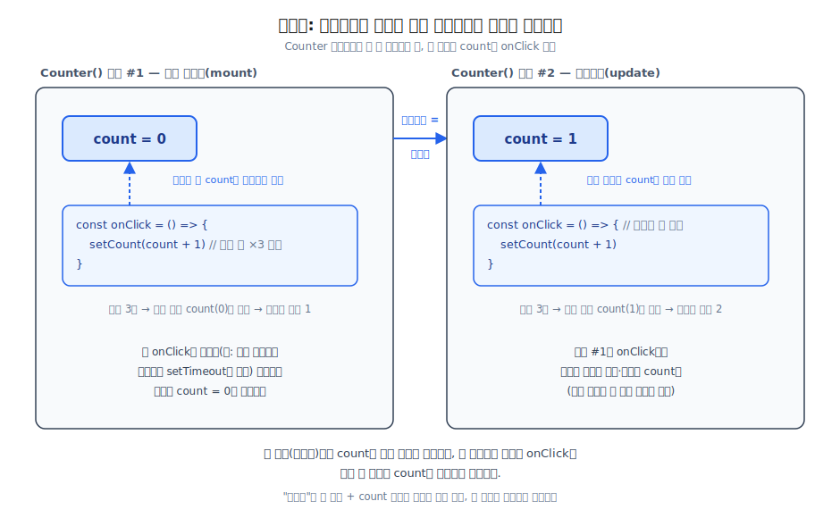

# 클로저(Closure) 정리

`count + 1`이 왜 렌더링 시점의 값에 고정되는지 설명하다가 "클로저"라는 개념 자체를 다시 짚게 되어 따로 정리한다.

## count가 클로저와 무슨 관계인가

`const [count, setCount] = useState(0)`에서 `count`는 "값이 바뀌면 자동으로 갱신되는 살아있는 변수"가 아니라, **렌더링 한 번마다 새로 생기는 지역 상수**다.

```jsx
function Counter() {
  const [count, setCount] = useState(0); // 이 줄이 실행될 때마다 count는 새 const로 선언됨

  const onClick = () => {
    setCount(count + 1);
    setCount(count + 1);
    setCount(count + 1);
  };

  return <button onClick={onClick}>{count}</button>;
}
```

React가 리렌더링을 한다는 건 `Counter`라는 평범한 JS 함수를 처음부터 다시 호출하는 것뿐이다. 매 호출(=매 렌더링)마다 `count`라는 지역 변수가 새로 생기고, 그 안에서 정의된 `onClick`은 자신이 태어난 그 호출의 `count`를 클로저로 붙들고 있다.

버튼을 한 번 클릭하면 `onClick` 함수 하나의 실행이 시작된다. 이 실행 안에서 `setCount(count+1)`을 세 줄 연달아 불러도, 아직 리렌더링이 일어나지 않았으니 `Counter` 함수가 다시 호출되지 않았고 새로운 `count`도 만들어지지 않는다. 세 줄 모두 `onClick`이 정의될 때 클로저로 캡처해둔 같은 `count`(예: 0)를 읽는다. 그래서 `count + 1`이 세 번 다 `0 + 1 = 1`로 계산된다.



## 클로저라는 용어는 대상을 가리키는가, 현상을 가리키는가

**대상을 가리킨다.** "함수가 외부 변수를 기억하는 현상"이 아니라, **"함수 + 그 함수가 정의될 때 참조했던 외부 변수들"이 하나로 묶인 구체적인 조합** 그 자체가 클로저다.

```js
function makeCounter(start) {
  const count = start;
  return function () {      // 이 함수 자체가 "클로저"라는 대상이다
    console.log(count);
  };
}

const logA = makeCounter(0);
```

`logA`에 담긴 함수가 클로저다. 정확히는 "`function () { console.log(count) }`라는 함수 코드"와 "그 함수가 태어날 때 붙잡은 `count=0`이라는 외부 변수 참조"가 하나로 묶인 패키지 전체를 가리킨다.

"함수가 외부 변수를 기억한다"는 동작(현상)은, 클로저라는 대상이 존재하기 때문에 관찰되는 결과다.

1. 자바스크립트는 함수를 만들 때마다 그 함수에 "이 함수가 정의된 스코프"에 대한 참조를 같이 저장한다 → 이 조합(함수 + 스코프 참조) = 클로저
2. 그 결과로 "외부 함수 실행이 끝나도 내부 함수가 외부 변수를 계속 읽을 수 있다"는 현상이 관찰된다

엄밀히 말하면 자바스크립트의 모든 함수는 정의되는 순간 이 스코프 참조를 갖게 되므로 기술적으로는 모든 함수가 클로저다. 다만 보통 "이거 클로저다"라고 굳이 언급하는 경우는, 외부 함수의 실행이 끝난 뒤에도 내부 함수가 그 외부 변수 참조를 계속 살려서 들고 있는 게 눈에 띄게 관찰될 때다.

## 왜 그렇게 동작하는가 (순수 JS 관점)

`makeCounter`를 두 번 호출하면, 자바스크립트 엔진은 호출할 때마다 완전히 별개의 실행 공간(실행 컨텍스트)을 만든다.

```js
const logA = makeCounter(0);    // makeCounter(0) 실행 → count=0인 실행 컨텍스트 생성
const logB = makeCounter(100);  // makeCounter(100) 실행 → count=100인 별개의 실행 컨텍스트 생성

logA(); // 0
logB(); // 100
```

그 안에서 선언된 `count`는 그 실행 공간에만 속한 변수다. `logA`와 `logB`는 각자 자신이 태어난 실행 공간의 `count`를 계속 붙들고 있다. `makeCounter` 함수 호출 자체는 이미 끝났는데도(`return`으로 빠져나갔는데도), 내부 함수가 그 변수를 참조하고 있는 한 자바스크립트 엔진은 그 실행 공간을 메모리에서 지우지 않고 살려둔다.

즉 클로저가 생기는 이유는 `useState`나 훅의 특별한 마법이 아니라, "함수 호출 = 독립된 변수 공간 생성"이라는 규칙과 "내부 함수는 자신이 정의된 공간을 계속 참조할 수 있다"는 규칙, 이 두 가지 자바스크립트 기본 규칙이 합쳐진 결과다.

## 클로저가 생기는 경우 — return만이 아니다

클로저가 생기는 핵심 조건은 "내부 함수가 외부 스코프의 변수를 참조하면서, 그 함수가 정의된 곳 밖으로 전달되거나 나중에 실행되는 것"이고, 전달 방법은 여러 가지다.

### return

```js
function makeCounter(start) {
  const count = start;
  return function () { console.log(count); }; // 반환해서 외부로 전달
}
```

### 콜백 인자로 전달 — 지금까지의 React 예제가 실제로 이 방식이었다

```jsx
function Counter() {
  const [count, setCount] = useState(0);

  return (
    <button onClick={() => setCount(count + 1)}>클릭</button>
    //              ↑ return이 아니라 onClick 인자로 전달됨
  );
}
```

`onClick={() => setCount(count + 1)}`는 `return`으로 빠져나가는 게 아니라 JSX의 `onClick` 프롭(인자)으로 전달된다. `setTimeout(() => setCount(count + 1), 3000)`도 콜백을 인자로 넘기는 방식이다. `addEventListener`, 배열 메서드도 마찬가지다.

```js
function setup(id) {
  document.getElementById('btn').addEventListener('click', () => {
    console.log(id); // id를 참조하는 클로저, 콜백으로 전달됨
  });
}
```

### 외부 변수나 객체 프로퍼티에 할당

```js
let savedFn;

function outer() {
  const secret = 42;
  savedFn = () => console.log(secret); // 반환도 콜백도 아니고, 그냥 외부 변수에 대입
}

outer();
savedFn(); // 42 — outer()는 이미 끝났지만 secret은 살아있음
```

### 반복문에서 매 반복마다 생기는 클로저

```js
for (let i = 0; i < 3; i++) {
  setTimeout(() => console.log(i), 100); // 0, 1, 2 각각 출력
}
```

`let`은 반복마다 새로운 `i` 바인딩을 만들기 때문에, 각 콜백이 서로 다른 `i`를 참조하는 별개의 클로저가 된다. (`var`를 쓰면 전부 같은 `i`를 공유해서 `3, 3, 3`이 찍히는 유명한 클로저 버그가 발생한다.)

## 정리

- `count`는 렌더링 한 번마다 새로 생기는 지역 상수이고, `onClick` 같은 함수는 자신이 정의된 렌더링의 `count`만 클로저로 캡처한다. 리렌더링 전까지는 몇 번을 읽어도 항상 같은 값이다.
- "클로저"는 현상이 아니라 대상이다 — 함수와 그 함수가 정의될 때 참조한 외부 변수들이 하나로 묶인 구체적인 조합을 가리킨다.
- 클로저가 생기는 이유는 자바스크립트의 두 기본 규칙(함수 호출마다 독립된 변수 공간 생성 + 내부 함수는 자신이 정의된 공간을 계속 참조 가능) 때문이다. React나 훅의 특별한 기능이 아니다.
- 클로저는 `return`으로만 생기지 않는다. 콜백 인자로 전달(`onClick`, `setTimeout`, `addEventListener`), 외부 변수에 대입, 반복문에서의 변수 캡처 등 다양한 경로로 발생한다.
