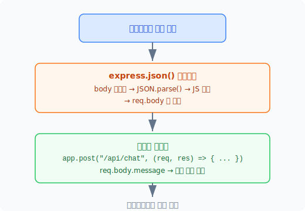
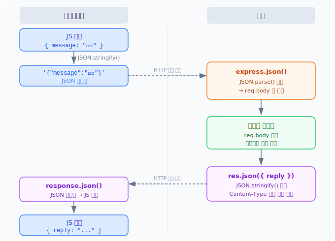

# 오늘 학습한 내용

## [Node.js / Express] express.json() 미들웨어와 JSON 직렬화·역직렬화 흐름

### express.json() 미들웨어란?

Express 서버에서 `app.use(express.json())`를 등록하면, 클라이언트가 보낸 요청의 body를 자동으로 JS 객체로 파싱해서 `req.body`에 담아준다.

```js
const app = express();
app.use(express.json()); // 미들웨어 등록
```

등록하지 않으면 라우트 핸들러 안에서 `req.body`가 `undefined`가 된다.

---

### 요청(Request) 흐름: 클라이언트 → 서버

HTTP body는 텍스트(문자열)만 실어 보낼 수 있다. JS 객체를 그대로 넣으면 `"[object Object]"` 라는 쓸모없는 문자열이 전송되므로, 클라이언트에서 반드시 `JSON.stringify()`로 직렬화해야 한다.

```js
// 클라이언트 (index_06_front.js)
fetch("http://localhost:3000/api/chat", {
  method: "POST",
  headers: { "Content-Type": "application/json" },
  body: JSON.stringify({ message }), // ← 직렬화
});
```

서버의 `express.json()` 미들웨어는 이 문자열을 받아 내부적으로 `JSON.parse()`를 호출해 JS 객체로 역직렬화한 뒤 `req.body`에 넣어준다.

```js
// 서버 (라우트 핸들러)
app.post("/api/chat", (req, res) => {
  const { message } = req.body; // ← 이미 파싱된 JS 객체
});
```

---

### 미들웨어가 끼어드는 지점

미들웨어는 요청이 **라우트 핸들러에 도달하기 직전**에 실행된다. 라우트 핸들러란 `app.get`, `app.post`, `app.put`, `app.delete` 같이 특정 URL + HTTP 메서드에 반응하는 함수들을 말한다.



`express.json()`은 **요청 방향에만** 관여한다. 응답 방향은 별개다.

---

### 응답(Response) 흐름: 서버 → 클라이언트

응답을 보낼 때는 `res.json()`을 사용한다. 이 메서드가 내부적으로 `JSON.stringify()`와 `Content-Type: application/json` 헤더 설정을 대신 처리해준다.

```js
res.json({ reply: "안녕" });

// 위 코드는 아래와 동일한 효과
res.setHeader("Content-Type", "application/json");
res.send(JSON.stringify({ reply: "안녕" }));
```

클라이언트에서는 `response.json()`으로 다시 역직렬화해서 JS 객체로 받는다.

```js
fetch(...)
  .then((response) => response.json()) // ← 역직렬화
  .then((data) => console.log(data));   // data는 JS 객체
```

---

### JSON 내장 객체와 JS 객체의 구분

`JSON`은 JS의 전역 내장 객체로, `stringify`와 `parse` 두 메서드를 제공한다.

| 메서드 | 방향 | 결과 |
|---|---|---|
| `JSON.stringify(obj)` | JS 객체 → 문자열 | JSON 형식의 문자열 |
| `JSON.parse(str)` | 문자열 → JS 객체 | 일반 JS 객체 |

`JSON.parse()` 결과물은 **일반 JS 객체**다. JSON은 텍스트 포맷의 이름이고, 파싱이 끝나는 순간 JS 객체가 되므로 "JSON 객체"라는 표현은 부정확하다.

---

### 전체 흐름 요약



| 지점 | 담당 | 역할 |
|---|---|---|
| 클라이언트 → 서버 (보낼 때) | `JSON.stringify()` | JS 객체 → JSON 문자열 (개발자가 직접) |
| 서버 수신 시 | `express.json()` 미들웨어 | JSON 문자열 → JS 객체, req.body에 저장 |
| 서버 → 클라이언트 (응답 시) | `res.json()` | JS 객체 → JSON 문자열 (Express가 자동) |
| 클라이언트 수신 시 | `response.json()` | JSON 문자열 → JS 객체 |
